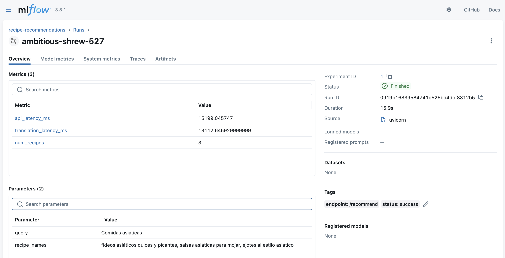

# 🍽️ Recipe Recommender API

Welcome! This project is a smart API that recommends cooking recipes using OpenAI language models and embeddings, with a modern and simple MLOps stack.

## 🚀 What does it do?
- Receives a user query (e.g., "healthy breakfast")
- Finds relevant recipes using embeddings and popularity
- Translates and returns recipes in Spanish, well formatted
- Logs every query, result, and metrics to MLflow for monitoring and analysis

## 🛠️ Main Technologies
- **FastAPI**: Fast, modern web API
- **OpenAI**: Embeddings and translation with LLM
- **Qdrant**: Semantic search for recipes
- **MLflow**: Tracks metrics, inputs, and outputs (MLOps)
- **Cloud Run & Cloud SQL**: Deployment and storage on Google Cloud

## 📦 Structure
- `app.py` — Main API and recommendation logic
- `mlflow-server/` — MLflow server ready to deploy on Cloud Run
- `requirements.txt` — Project dependencies

## 🌐 Deployment & MLOps
1. **Deploy MLflow Server** on Cloud Run (see `mlflow-server/`)
2. **Deploy the API** on Cloud Run and link it to MLflow using the `MLFLOW_TRACKING_URI` variable
3. **Monitor everything** from the MLflow web UI (queries, latencies, results)



## 📝 Example Usage
```bash
curl -X POST https://YOUR-API/recommend \
  -H "Content-Type: application/json" \
  -d '{"query": "healthy breakfast"}'
```

## 📊 What gets tracked in MLflow?
- User query
- Total and translation latency
- Returned recipes (names and full JSON)
- Status (success/error)

## 💡 Ideal for...
- Recipe recommendation projects
- Production MLOps demos
- OpenAI + FastAPI + MLflow integration examples

---

Made with ❤️ for the project.
